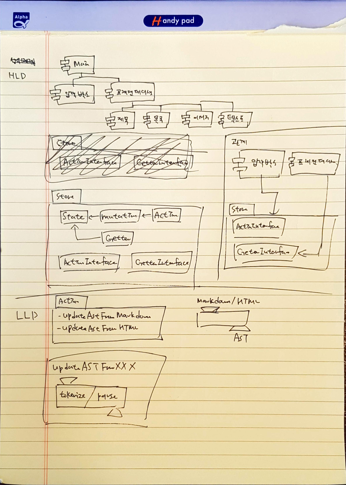

## 설계 그림


## HLD(High Level Design)
- UI 컴포넌트와 스토어로 구성된다.
- UI 컴포넌트는 역할별로 계층구조를 갖는다.
- 스토어는 단일 상태를 가진다.
  - 상태 변경은 Mutation을 통해서만 가능하다.
  - 상태 변경 요청은 Action을 통해서만 가능하다.
- 스토어는 특정 인터페이스를 통해서만 접근 가능하다.
  - `ActionInterface`
  - `GetterInterface`

### 관계
- UI 컴포넌트와 스토어의 관계다.
- 입력박스 컴포넌트는 스토어의 `ActionInterface`를 사용한다.
- 프레젠테이션 컴포넌트는 스토어의 `GetterInterface`를 사용한다.

## LLD(Low Level Design)
### Action
- `updateASTFromMarkdown`, `updateASTFromHTML` 형태의 인터페이스를 제공한다.
- 특정 입력 포맷을 AST로 변경하여, Mutation에 요청한다.

#### updateASTFromXXX
- 함수는 Tokenize와 Parse 단계로 실행된다.

### AST
```ts
type HeadingType = 'h1' | 'h2' | 'h3' | 'h4' | 'h5' | 'h6'
type ImageType = 'img'
type TextType = 'text'

type ContentASTType = HeadingType | ImageType | TextType  

interface ContentAST {
  type: ContentASTType
  value: string
}

type ListItemType = 'li'
interface ListItemAST {
  type: ListItemType
  value: string
}

type ListType = 'ul' | 'ol'
interface ListAST {
  type: ListType
  children: ListItemAST[]
}

type SectionType = 'section'
type SectionChild = ContentAST | ListAST
interface SectionAST {
  type: SectionType
  children: SectionChild[]
}

interface AST {
  type: 'main'
  children: SectionAST[]
}
```

### 상태변경감지
```js
Store.GetterInterface('ast', (newAst) => {})
```

### 컴포넌트
```ts
type defineComponent = (ast?: AST) => HTMLElement | null

interface HTMLOptions {
  events?: object
  attrs?: object
}

type html = (
  tagName: string,
  children: string | HTMLElement,
  options?: HTMLOptions
) => HTMLElement
```

#### 텍스트
```js
export default defineComponent((ast) => {
  return ast.type === 'text'
    ? html('p', ast.value)
    : null;
})
```

#### 자식 요소
```js
const renderListItem = (ast) => {
  return ast.type === 'li'
    ? html('li', ast.value)
    : null;
};
const render = (ast) => {
  const listItem = ast.children
    ? ast.children.map(renderListItem)
    : []; 
  return ast.type === 'ul'
    ? html('ul', listItem)
    : null;
};

export default defineComponent(render);
```

#### 이벤트 할당
```js
export default defineComponent(() => {
  const events = {
    click: () => console.log('onClick')
  };
  const attrs = {
    type: 'button'
  };
  return html('button', '버튼', {events, attrs})
})
```

```js
export default defineComponent(() => {
  const events = {
    change: (event) => console.log('onChange')
  };
  return html('textarea', '', {events})
})
```

```js
export default defineComponent((ast) => {
  const event = {
    change: () => console.log('onChange')
  };
  return ast.type === 'text'
    ? html('p', ast.value, event)
    : null;
})
```

```js
const renderListItem = (ast) => {
  const event = {
    click: () => console.log('onClick')
  };
  return ast.type === 'li'
    ? html('li', ast.value, event)
    : null;
};
const render = (ast) => {
  const listItem = ast.children
    ? ast.children.map(renderListItem)
    : []; 
  return ast.type === 'ul'
    ? html('ul', listItem)
    : null;
};

export default defineComponent(render);
```
